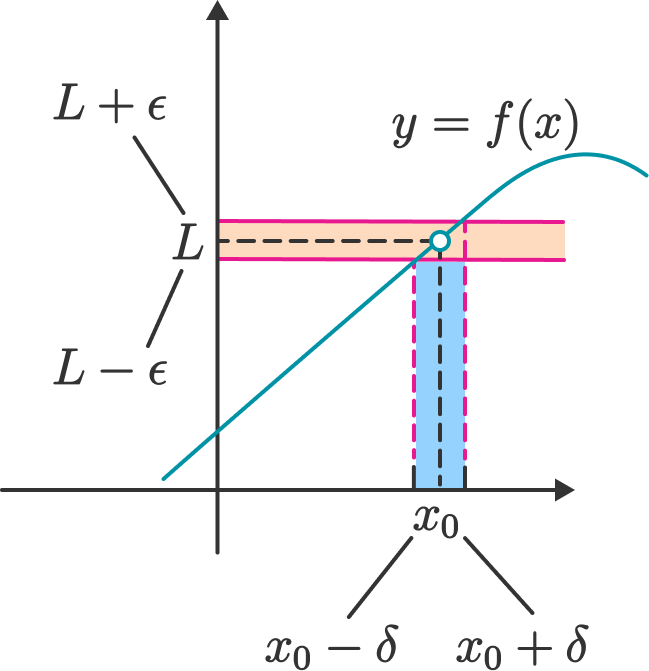

# Definicija i temeljna teorija, neprekidnost {.unnumbered}

## Limes niza {.unnumbered}

:::{.def}
Funkciju $a \colon \mathbb{N} \to S$ zovemo **niz** u $S$. 
:::

Uobičajena oznaka funkcijskih vrijednosti je $a(n)=a_n$, a oznaka niza $(a_n)_{n \in \mathbb{N}}$, $(a_n)_n$ ili samo $(a_n)$.

Primjeri nekih nizova:

- $a_n = \frac{1}{n}, \ \forall n \in \mathbb{N}$ niz je u $\mathbb{R}$
- $a_n = n+\frac{i}{n}, \ \forall n \in \mathbb{N}$ niz je u $\mathbb{C}$
- $a_n(x)= \sin (nx)$ niz realnih funkcija

:::{.def}
Neka je $(a_n)_n$ niz u $\mathbb{R}$. Niz $(a_n)_n$ je:

- rastući ako $\forall n \in \mathbb{N}, a_n \leq a_{n+1}$
- strogo rastući ako $\forall n \in \mathbb{N}, a_n < a_{n+1}$
- padajući ako $\forall n \in \mathbb{N}, a_n \geq a_{n+1}$
- strogo padajući ako $\forall n \in \mathbb{N}, a_n > a_{n+1}$
:::

Definicija monotonosti niza odgovara našoj intuiciji. Doduše, za nizove u $\mathbb{R}^n$ nećemo moći govoriti o monotonosti, ali uvest ćemo pojam ograničenosti.

Definirajmo sada **limes**:

:::{.def}
Niz realnih brojeva $(a_n)_n$ **konvergira** ili teži k realnom broju $a \in \mathbb{R}$ ako svaki otvoreni interval polumjera $\varepsilon$ oko točke $a$ sadrži gotovo sve članove niza, tj.
$$
(\forall \varepsilon > 0)(\exists n_{\varepsilon} \in \mathbb{N})(\forall n \in \mathbb{N})
((n > n_{\varepsilon}) \rightarrow (|a_n - a| < \varepsilon))
$$

Tada $a$ zovemo **granična vrijednost** ili **limes** niza $(a_n)_n$ i pišemo $a = \lim_{n \to \infty} a_n$.

Ako niz ne konvergira, kažemo da **divergira**.
:::

Možemo definirati i konvergenciju prema $+ \infty$ i $- \infty$, ali trenutno nema potrebe za to. Sada navodimo neke bitne rezultate, ali bez dokaza.

:::{.teorem}
1. Konvergentan niz u $\mathbb{R}$ ima samo jednu graničnu vrijednost.
2. Konvergentan niz u $\mathbb{R}$ je ograničen.
:::

:::{.teorem}
Svaki monoton i ograničen niz u $\mathbb{R}$ je konvergentan.
:::

:::{.teorem}
Neka su $(a_n)_n$ i $(b_n)_n$ konvergentni nizovi u $\mathbb{R}$. Tada vrijedi:

1. Niz $(a_n \pm b_n)_n$ je konvergentan i vrijedi $\displaystyle \lim_{n \to \infty}(a_n \pm b_n)_n = \lim_{n \to \infty} a_n \pm \lim_{n \to \infty} b_n$
2. Niz $(a_n \cdot b_n)_n$ je konvergentan i $\displaystyle \lim_{n \to \infty} (a_n \cdot b_n)_n = \lim_{n \to \infty} a_n \cdot \lim_{n \to \infty} b_n$
3. Ako je $\forall n \in \mathbb{N}, b_n \neq 0$ i $\displaystyle \lim_{n \to \infty} b_n \neq 0$, onda je niz $\displaystyle \left (\frac{a_n}{b_n} \right)_n$ konvergentan i vrijedi $\displaystyle \lim_{n \to \infty} \left (\frac{a_n}{b_n} \right)_n = \displaystyle \frac{\displaystyle \lim_{n \to \infty} a_n}{\displaystyle\lim_{n \to \infty} b_n}$ 
4. Niz $(|a_n|)_n$ je konvergentan i $\displaystyle\lim_{n \to \infty} |a_n| = |\displaystyle \lim_{n \to \infty} a_n|$
:::

:::{.korolar}
Neka su $\displaystyle \lim_{n \to \infty} a_n = a$ i $\displaystyle \lim_{n \to \infty} b_n = b$. Tada je za sve $\lambda, \mu \in \mathbb{R}$ niz $(\lambda a_n + \mu b_n)_n$ konvergent i vrijedi $\displaystyle \lim_{n \to \infty} (\lambda a_n + \mu b_n) = \lambda a + \mu b$.
:::

Iz prethodnog teorema i korolara vidimo da je skup svih konvergentnih nizova u $\mathbb{R}$ zatvoren na linearne kombinacije svojih elemenata, stoga zaključujemo da je skup konvergentnih nizova u $\mathbb{R}$ vektorski prostor.

## Limes funkcije {.unnumbered}

Sada prelazimo na limes funkcija, sljedećom definicijom vidimo vezu s limesom niza:

:::{.def}
Neka je $I \subseteq \mathbb{R}$ otvoreni interval i $c \in I$. Za funkciju $f \colon I \backslash \{c\} \to \mathbb{R}$ kažemo da ima limes u točki $c$ jednak $L$ ako **za svaki** niz $(c_n)_n$ u $I \backslash \{c\}$ vrijedi 
$$ 
\lim_{n \to \infty} c_n = c \Rightarrow \lim_{n \to \infty} f(c_n) = L
$$  

Tada pišemo $\displaystyle \lim_{x \to c} f(x) = L$.
:::

Iz definicije je vidljivo da je približavanje broja $x$ prema $c$ ekvivalentno približavanju svih nizova koji konvergiraju k točki $c$. Dakle, u definiciji je potrebno promatrati sve takve nizove, a ne samo jedan niz ili njih konačno mnogo. Tada se slike tih nizova po funkciji $f$ moraju približavati istom broju $L$. S druge strane, nizovi koji konvergiraju k $c$ imaju točke i lijevo i desno od $c$ pa je prirodno pretpostaviti da je točka $c$ iz nekog otvorenog intervala koji je sadržan u domeni funkcije $f$.

Pojam limesa funkcije moguće je definirati i bez nizova i to je sadržaj Cauchyjeve definicije limesa:

:::{.teorem}
Neka je $I \subseteq \mathbb{R}$ otvoreni interval, $c \in I$ i $f \colon I \backslash \{c\} \to \mathbb{R}$. Limes funkcije $f$ u točki $c$ postoji i $\lim_{x \to c} f(x) = L$ ako i samo ako vrijedi:
$$
(\forall \varepsilon > 0)(\exists \delta > 0)(\forall x \in I)((0 < |x-c| < \delta) \rightarrow (|f(x) - L| < \varepsilon))
$$
:::

Cauchyjeva definicija ima intuitivnu geometrijsku interpretaciju. Za svaku okolinu $\langle L− \varepsilon,L+ \varepsilon \rangle$ broja $L$ postoji okolina $\langle c− \delta, c + \delta \rangle$ broja $c$ koja se, s izuzetkom točke $c$, preslikava u okolinu $\langle L− \varepsilon,L+ \varepsilon \rangle$, tj.
$$
f(\langle c− \delta, c + \delta \rangle \backslash \{c\}) \subseteq \langle L− \varepsilon,L+ \varepsilon \rangle
$$

Limes funkcije u skladu je s operacija zbrajanja, oduzimanja, množenja i dijeljenja:

:::{.teorem}
Neka je $I \subseteq \mathbb{R}$ otvoreni interval, $c \in I$ i $f,g \colon I \backslash \{c\} \to \mathbb{R}$ za koje postoje $\displaystyle \lim_{x \to  c} f(x)$ i $\displaystyle \lim_{x \to  c} g(x)$. Tada vrijedi: 

1. Funkcija $f \pm g$ ima limes u $c$ i vrijedi $\displaystyle \lim_{x \to c} (f(x) \pm g(x)) = \lim_{x \to c} f(x) \pm \lim_{x \to c} g(x)$
2. Za svaki $\lambda \in \mathbb{R}$ funkcija $\lambda f$ ima limes u $c$ i vrijedi $\displaystyle \lim_{x \to c} \lambda f(x) = \lambda \lim_{x \to c} f(x)$
3. Funkcije $fg$ ima limes u $c$ i  vrijedi $\displaystyle \lim_{x \to c} (f(x)g(x)) = \lim_{x \to c} f(x) \lim_{x \to c} g(x)$
3. Ako je $g(x) \neq 0, \forall x \in I \backslash \{c\}$ i $\displaystyle \lim_{x \to c} g(x) \neq 0$, onda je funkcija $\displaystyle \frac{f}{g}$ ima limes u $c$ i vrijedi $\displaystyle \lim_{x \to c} \left (\displaystyle \frac{f(x)}{g(x)} \right) = \frac{\displaystyle \lim_{x \to c} f(x)}{\displaystyle \lim_{x \to c} g(x)}$ 
4. Funkcija $|f|$ ima limes u $c$ i $\displaystyle \lim_{x \to c} |f(x)| = |\displaystyle \lim_{x \to c} f(x)|$
:::

Kao i kod nizova, možemo definirati limes u $\pm \infty$.

Definirajmo sada lijevi i desni limesi.

:::{.def}
Neka je $I \subseteq \mathbb{R}$ otvoreni interval i $c \in I$. Za funkciju $f \colon I \backslash \{c\} \to \mathbb{R}$ kažemo da ima

1. **limes slijeva** u točki $c$ jednak $L$ ako vrijedi
$$
(\forall \varepsilon > 0)(\exists \delta > 0)(\forall x \in I)((0 < c-x < \delta) \rightarrow (|f(x) - L| < \varepsilon))
$$

Tada pišemo $\displaystyle \lim_{x \to c-} f(x) = f(c-) = L$.

2. **limes slijeva** u točki $c$ jednak $L$ ako vrijedi
$$
(\forall \varepsilon > 0)(\exists \delta > 0)(\forall x \in I)((0 < x-c < \delta) \rightarrow (|f(x) - L| < \varepsilon))
$$

Tada pišemo $\displaystyle \lim_{x \to c+} f(x) = f(c+) = L$.
:::

Uzmimo za ilustraciju funkciju $f$ definiranu kao 
$$ f(x) =
\begin{cases}
1 & x > 1 \\
0 & x = 0 \\
-1 & x < -1 
\end{cases}
$$

$$
\lim_{x \to 0-} f(x) = -1 \neq 1 = \lim_{x \to 0+} f(x)
$$

Vidimo da se lijevi i desni limes razlikuju u točki $c=0$ pa pomoću sljedećeg rezultata zaključujemo da limes ove funkcije u točki $c=0$ ne postoji.

:::{.teorem}
Neka je $I \subseteq \mathbb{R}$ otvoreni interval, $c \in I$ i $f \colon I \backslash \{c\} \to \mathbb{R}$. Za funkciju $f$ postoji $\displaystyle \lim_{x \to c} f(x)$ ako i samo postoje i jednaki su $\displaystyle \lim_{x \to c-} f(x)$ i $\displaystyle \lim_{x \to c+} f(x)$.
:::

:::{.primjer}
Odredimo limes $\displaystyle \lim_{x \to \infty} \dfrac{5x^2 - 1}{3x^2 + 1}$.

Klasični postupak je dijeljenje brojnika i nazivnika dominatnim članom (najvećom potencijom u ovom slučaju). Uočimo, kad podijelimo i brojnik i nazivnik istim brojem, razlomak se ne mijenja!
$$
\displaystyle \lim_{x \to \infty} \dfrac{5x^2 - 1}{3x^2 + 1} = 
\displaystyle \lim_{x \to \infty} \dfrac{(5x^2 - 1) \dfrac{1}{x^2}}{(3x^2 + 1) \dfrac{1}{x^2}} =
\displaystyle \lim_{x \to \infty} \dfrac{5 - \dfrac{1}{x^2}}{3 + \dfrac{1}{x^2}} = \dfrac{5 - 0}{3 + 0} = \dfrac{5}{3}
$$

U drugoj jednakosti koristili smo svojstvo da limesi može *ući* u razlomak.
:::

## Neprekidnost {.unnumbered}

:::{.def}
Neka je $I \subseteq \mathbb{R}$ otvoreni interval i $c \in I$. Za funkciju $f \colon I \to \mathbb{R}$ kažemo da je **neprekidna** u točki $c$ ako postoji limes funkcije $f$ u točki $c$ i $\displaystyle \lim_{x \to c} f(x) = f(c)$. Funkcija $f$ je neprekidna na skupu $I$ ako je neprekidna u svakoj točki $c \in I$.
:::

Slikovito rečeno, grafove neprekidnih funkcija možemo nacrtati potezom ruke bez odizanja olovke s papira.

Iskažimo Cauchyjevu definiciju:

:::{.def}
Neka je $I \subseteq \mathbb{R}$ otvoreni interval, $c \in I$ i $f \colon I \to \mathbb{R}$. Funkcija $f$ je neprekidna u točki $c$ ako i samo ako vrijedi:
$$
(\forall \varepsilon > 0)(\exists \delta > 0)(\forall x \in I)((|x-c| < \delta) \rightarrow (|f(x) - f(c)| < \varepsilon))
$$
:::

Imamo jednostavnu interpretaciju: za svaku okolinu točke $c$ slika te okoline po neprekidnoj funkciji $f$ je okolina točke $f(c)$.

{width=50% fig-align="center"}

:::{.primjer}
Pokažimo da je funkcija $f(x) = x^2$ neprekidna u točki $c = 1$. Neka je $\varepsilon > 0$. Trebamo naći $\delta > 0$ takvo da vrijedi:
$$
|x - 1| < \delta \Rightarrow |f(x) - f(1)| < \varepsilon 
$$

$$
|f(x) - f(1)| = |x^2 - 1| = |(x-1)(x+1)| < \varepsilon
$$

Ocijenimo sada $|x+1|$:
$$
|x+1| = |x-1 + 2| \leq |x-1| + 2 < \delta + 2
$$

Sada imamo
$$
|f(x) - f(1)| = |x^2 - 1| = |(x-1)(x+1)| < \delta(\delta + 2) < \varepsilon
$$

Dodajmo uvjet $\delta < 1$ i dobijemo $\delta(\delta + 2) < 3\delta$. Sada možemo odabrati $\delta = \min \left\{1, \frac{\varepsilon}{3} \right\}$ i time smo pokazali da je funkcija $f(x) = x^2$ neprekidna u točki $c = 1$.

**Napomena:** u zadatci u kojima je potrebno pokazati neprekidnost neke funkcije najbitnije je dobro baratati nejednakostima i ocjenama, a tu nam najviše koristi nejednakost trokuta ($|a+b| \leq |a| + |b|$) i svojstvo apsolutne vrijednosti.
:::

Sljedeći teorem poznat nam je iz analogona za nizove i limese funkcija:

:::{.teorem}
Neka je $I \subseteq \mathbb{R}$ otvoreni interval, $c \in I$ i $f,g \colon I \to \mathbb{R}$ neprekidne u $c$. Tada vrijedi:

1. Za sve $\lambda, \mu \in \mathbb{R}$ funkcija $\lambda f + \mu g$ je neprekidna u $c$. 
2. Funkcija $fg$ je neprekidna u $c$.
3. Ako je $g(x) \neq 0, \forall x \in I$, tada je funkcija $\displaystyle \frac{f}{g}$ neprekidna u $c$.
:::

Pokažimo da je i kompozicija neprekidnih funkcija neprekidna:

:::{.teorem}
Neka su $I,J \subseteq \mathbb{R}$ otvoreni intervali, $f \colon I \to \mathbb{R}$ i $g \colon J \to \mathbb{R}$ funkicije za koje vrijedi $f(I) \subseteq J$, tj. kompozicija $g \circ f \colon I \to \mathbb{R}$ je dobro definirana na $I$. Ako je $f$ neprekidna u točki $c \in I$ i funkcija $g$ neprekidna u točki $d = f(c) \in J$, onda $g \circ f$ neprekidna u točki $c$.
:::

:::{.dokaz}

Prikaži dokaz

Neka je $\varepsilon > 0$ proizvoljan. Tada postoji $\eta > 0$ takav da je
$$
(\forall y \in J)(|y - d| < \eta \Rightarrow |g(y) - g(d)| < \varepsilon)
$$

Isto tako, kako je $f$ neprekidna u $c$, za svaki $\eta > 0$ postoji $\delta > 0$ takav da je
$$
(\forall x \in I)(|x - c| < \delta \Rightarrow |f(x) - f(c)| < \eta)
$$

Sada imamo
$$
(\forall x \in I)(|x - c| < \delta \Rightarrow |f(x) - f(c)| < \eta \Rightarrow |g(f(x)) - g(f(c))| < \varepsilon)
$$

Dakle, $g \circ f$ je neprekidna u točki $c$.

:::

Pokažimo rezultat za inverznu funkciju:

:::{.teorem}
Neka je $I \subseteq \mathbb{R}$ otvoreni interval, funkcija $f \colon I \to \mathbb{R}$ i $I' = f(I)$.

1. Ako je $f$ strogo monotona i neprekidna na $I$, onda je $I'$ otvoren
interval i $f^{-1} : I' \to I$ neprekidna funkcija na $I'$.
2. Ako je $f$ neprekidna bijekcija sa $I$ na $I'$, onda je $f$ strogo monotona
funkcija na $I$ i $f^{-1} : I' \to I$ neprekidna funkcija na $I'$.
:::

Kako smo definirali lijevi i desni limes, tako možemo definirati i liveu i desnu neprekidnost u točki $c$.

## Neprekidnost na segmentu {.unnumbered}

Jedan od najpoznatijih i najkorisnijih rezultata u realnoj analizi u jednoj dimenziji je Bolzano-Weierstrassov teorem za neprekidne funkcije:

:::{.teorem}
Neka je funkcija $f \colon [a,b] \to \mathbb{R}$ neprekidna na segmentu $[a,b] \subseteq \mathbb{R}$. Tada je $f([a,b]) = [m,M]$ takoder segment.
:::

**Napomena:** iskažimo teorem na drugačiji način: neprekidan funkcija na segmentu postiže minimum i maksimum te sve među vrijednosti!

Navedeni teorem ima veliku primjenu u mateematičkoj analizi za traženje ekstrema funkcije, u numeričkoj matematici za traženje rješenja jednadžbi i u optimizaciji.